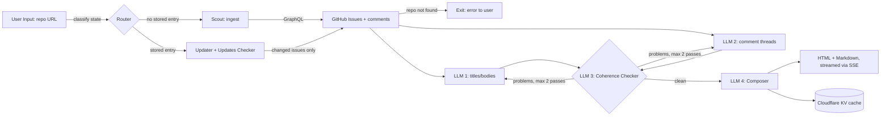

# Issue TL;DR: Design Document

Paste a public GitHub repository URL; get a short, source-anchored summary of
what its open issue tracker actually says: dominant themes, what needs
attention, and what nobody has answered yet.

This document is the source of truth for the architecture. It is written before
implementation and updated when a decision changes during the build.

---

## 1. Objective

Turn an open issue tracker (up to 100 issues plus their comment threads) into
one short, trustworthy briefing, so a maintainer or newcomer can understand the
state of a repo without reading every thread.

"Trustworthy" is a hard requirement, not a nice-to-have: the summary must be
anchored to real issue numbers and must not invent problems. That requirement is
what justifies the verification stage below.

---

## 2. System classification

This system is a **workflow**, not an autonomous agent.

The distinction matters and is stated deliberately: the path is fixed and known
at design time (fetch → summarize → verify → compose → store). No model decides
*what to do next*; models are called at fixed points to do bounded tasks. This
is the correct, cheaper, more predictable choice for a problem whose steps we can
enumerate in advance. We use the least autonomy that solves the problem.

The one place with genuine iteration is the coherence check (an
Evaluator-Optimizer loop, §4), and even that loop is bounded.

---

## 3. Architecture

---

## 4. Component roles (each node, and the pattern it implements)

| Component | Orchestration role | Is it an agent? | Responsibility |
| --- | --- | --- | --- |
| **Router** | **Routing pattern** (conditional edge) | No, deterministic branch | Classifies the request into one of two paths by checking KV: *cold* (never seen this repo) or *warm* (cached). Sends cold → Scout, warm → Updater. |
| **Scout** | Data-ingestion node (tool call) | No, deterministic fetch | Cold path. Calls the GitHub GraphQL API and pulls up to 100 open issues + up to 20 recent comments each. Pure I/O, no LLM. |
| **Updater + Updates Checker** | **Cache-with-change-detection** | No, deterministic | Warm path. Compares each issue's `updatedAt` against the cached copy; re-fetches only issues that moved, and drops digests for issues that have since closed. This is what makes a repeat run cheap. |
| **LLM 1, titles/bodies** | **Parallel Fan-Out** (runs concurrently with LLM 2) | LLM step, bounded task | Mechanical extraction: summarize each issue's title + body. High volume, low judgement. |
| **LLM 2, comment threads** | **Parallel Fan-Out** (runs concurrently with LLM 1) | LLM step, bounded task | Mechanical extraction: summarize each issue's comment thread. Same profile as LLM 1; running the two in parallel cuts wall-clock time (latency = the slower branch, not the sum). |
| **LLM 3, Coherence Checker** | **Evaluator** half of an **Evaluator-Optimizer loop** | LLM step, judgement task | Checks the LLM 1/LLM 2 digests against the source for hallucinations or incoherence. Emits a list of flagged issue numbers. If non-empty, the flagged issues (only those) go back to LLM 1/LLM 2 for a re-summary. **Bounded at 2 passes** to prevent an infinite loop; after that, the best current digest is accepted (graceful degradation). |
| **LLM 4, Composer** | Synthesis / final generation | LLM step, judgement task | Takes the verified per-issue digests and produces the reader-facing briefing: themes, "needs attention", "open questions", each anchored to issue numbers. This is the output the user actually reads. |
| **Storage (KV)** | State persistence | No | Writes the composed result + per-issue digests + fetch metadata to Cloudflare KV, 7-day TTL, so the next run can take the warm path. |

Naming honestly: only the **Router** (routing) and the **Coherence Checker**
(evaluator-optimizer) are named orchestration patterns doing real control-flow
work. LLM 1/2 are a **parallel fan-out**. Everything else is a deterministic
workflow step. Calling a plain fetch an "agent" would be wrong, and a reviewer
would catch it.

---

## 5. State / data model

The state that flows through the pipeline (and what persists to KV):

| Field | Type | Written by | Read by |
| --- | --- | --- | --- |
| `repo` | `owner/name` | input | Router, Scout |
| `path` | `cold` \| `warm` | Router | pipeline |
| `issues` | `Issue[]` | Scout / Updater | LLM 1, LLM 2 |
| `bodyDigests` | `Digest[]` | LLM 1 | LLM 3, LLM 4 |
| `commentDigests` | `Digest[]` | LLM 2 | LLM 3, LLM 4 |
| `flagged` | `issueNumber[]` | LLM 3 | loop back to LLM 1/2 |
| `passCount` | `int` | loop | loop guard (cap = 2) |
| `result` | `{ html, md }` | LLM 4 | browser, KV |

`Issue` = `{ number, title, body, comments[], updatedAt, state }`.
`Digest` = `{ issueNumber, summary }`.

---

## 6. Flow

**Cold path (repo never seen):**
1. Router finds no KV entry → `path = cold`.
2. Scout fetches issues + comments via GraphQL.
3. LLM 1 and LLM 2 summarize in parallel.
4. LLM 3 checks coherence; flagged issues loop back (≤2 passes).
5. LLM 4 composes the briefing.
6. Result streamed to browser (SSE) and written to KV.

**Warm path (repo cached):**
1. Router finds a KV entry → `path = warm`.
2. Updates Checker compares `updatedAt` per issue.
3. If nothing changed → serve the stored summary immediately (no model calls).
4. If some issues changed → re-fetch only those, re-summarize only those,
   re-run coherence on the affected set, re-compose, update KV.

The warm path is the cost story: a repeat run on an unchanged repo costs zero
model calls.

---

## 7. Key design decisions (the "why", stated up front)

- **GraphQL over REST for the Scout.** REST needs ~101 requests per repo (one
  for the issue list, one per issue for its comments). GraphQL fetches issues
  *and* their comments together in ~2 requests. Fewer round trips, far less
  rate-limit pressure, faster cold runs. Consequence: GraphQL rejects
  unauthenticated requests, so an operator token is required (§9).

- **Model routing by task type, not one model everywhere.** Every stage is
  assigned independently in `src/lib/llm/models.ts`. The assignments below are
  the result of measurement, not assumption. *(The original design named
  GPT-3.5, since retired.)*

  | Stage | Model | Why |
  | --- | --- | --- |
  | LLM 1, titles/bodies | `gpt-4o-mini` | Mechanical extraction, high volume |
  | LLM 2, comment threads | `gpt-4o-mini` | Same profile |
  | LLM 3, coherence checker | `gpt-4o-mini` | Matches `gpt-4o` at catching planted defects, at 1/17th the price |
  | LLM 4, composer | `gpt-4o` | The only output a human reads, and it runs once per cold run |

  **Measured cost per cold run** (three repos, before and after moving LLM 3
  off `gpt-4o`):

  | Repo | Open issues | Before | After | Change |
  | --- | --- | --- | --- | --- |
  | `lukeed/clsx` | 8 | $0.0147 | $0.0096 | -35% |
  | `developit/mitt` | 16 | $0.0241 | $0.0142 | -41% |
  | `colinhacks/zod` | 56 | $0.1044 | $0.0341 | -67% |

  Two findings worth recording, because both contradict the obvious guess:

  1. **The extraction stages were never the cost driver.** LLM 1 and LLM 2
     together account for 10% to 30% of a run. The verifier and the composer
     account for the rest, because LLM 3 runs up to three times per cold run
     over the full digest set. Optimising extraction first would have been
     effort spent in the wrong place.
  2. **Newer and smaller does not mean cheaper.** `gpt-5.4-mini`
     ($0.75/$4.50 per 1M) is five times dearer than `gpt-4o-mini`
     ($0.15/$0.60). `gpt-5-nano` is nominally cheapest per input token but
     spends roughly 1,850 hidden reasoning tokens on a 180-token extraction,
     billed as output, making it both slower and dearer in practice. Model
     ids must be priced against the actual token profile of the task.

- **Two models were tried for the cheap stages and rejected, on evidence.**

  - `gpt-4.1-nano` for **LLM 3**: it is a rubber stamp. Against four planted
    defects (wrong subject, an LLM 1/LLM 2 contradiction, a hallucinated
    fact, and a plainly wrong severity) it caught **0 of 4** across three runs
    each, while staying quiet on clean input. A verifier that never fails is
    worse than no verifier, because it manufactures confidence.
  - `gpt-4.1-nano` for **LLM 1/LLM 2**: cheaper and comparable on digest
    quality, but it silently omitted 3 to 4 of 56 issues from its JSON on the
    larger repo, where `gpt-4o-mini` omitted none. Those issues are recorded
    as `failed` and excluded from the briefing, so roughly 7% of the tracker
    goes missing. The saving was about 15% of a run; the coverage loss was
    not worth it.
  - `gpt-4.1-mini` for **LLM 3**: caught the wrong-subject and wrong-severity
    defects reliably but missed the LLM 1/LLM 2 contradiction in 2 of 3 runs
    and the hallucinated fact in 1 of 3. It is also dearer than `gpt-4o-mini`
    ($0.40/$1.60 versus $0.15/$0.60), so it loses on both axes.

  Verification method: the live LLM 3 prompt is run against a fixed ground
  truth with a known-good digest set and four deliberately corrupted sets,
  three samples each. Detection rate, not vibes, decided the assignment.

- **Bounded evaluator loop.** The coherence loop caps at **2 passes**. An
  unbounded "fix until perfect" loop is an infinite-loop and unbounded-cost
  risk. After the cap, the best current digest is accepted: graceful
  degradation over hanging.

- **Cost/scope limits, chosen not defaulted.** Up to 100 issues (most recently
  updated first), 20 comments per issue, bodies truncated to 4 000 chars,
  comments to 1 500. These bound token spend and latency deterministically.

- **The composer is now the remaining cost centre**, at 52% to 73% of a cold
  run. It is deliberately left on the strong model: it produces the only text
  a human reads, and it runs exactly once. Moving it to a cheap model would
  roughly halve the remaining cost again, and is the obvious next lever if the
  demo ever needs it, but it trades the one thing the product is judged on.

- **Change-detection cache (KV, 7-day TTL).** Re-summarize only what moved;
  drop digests for closed issues. Without this, every run pays full price.

- **Output sanitization.** The composer's Markdown derives from arbitrary
  GitHub text, so an issue titled `` can reach the
  summary. The renderer escapes raw HTML, restricts link schemes to
  `http(s)`/`mailto`, and renders images as alt text only. Treating issue text
  as untrusted input is a security decision, not a formatting one.

- **Streaming via SSE.** A cold run is 1–3 minutes of mostly I/O wait. Progress
  is streamed as server-sent events so the user sees each stage instead of a
  two-minute spinner. A UX decision that follows from the runtime profile.

- **Coherence checker derives `ok` from the problem list**, not from the
  model's own boolean. The code trusts the enumerated problems, not a
  self-reported "looks fine". Small but deliberate: don't let the evaluator
  grade itself on a flag it can flip.

---

## 8. Failure handling

- **Repo not found / no access** → Exit early with a clear message to the user.
- **GitHub rate limit / API error** → surface the error; the operator token
  keeps the normal case well under limits.
- **A single issue fails to summarize** → record the failure for that issue and
  continue; one bad issue does not abort the batch.
- **Coherence never converges within 2 passes** → accept the best digest
  (graceful degradation), never loop forever.
- **No KV configured** → the app still runs; it simply never caches and always
  takes the full cold path.

---

## 9. Required secrets

| Variable | Notes |
| --- | --- |
| `GITHUB_TOKEN` | PAT with `public_repo` read scope. The **operator's** token, not the visitor's; visitors never authenticate. Required because the Scout uses GraphQL. |
| `OPENAI_API_KEY` | Model access for LLM 1–4. |

---

## 10. Security model

The site is **public and has no login**. That single fact defines the whole
model: any protection the browser uses, the browser must receive, and anything
the browser receives, a person can read in DevTools. There is no way to have
"public, no login" *and* "impossible to abuse" at once. The design accepts that
and defends in **layers**, each with a stated job and stated limits.

| Layer | Mechanism | Stops | Does **not** stop |
| --- | --- | --- | --- |
| **Request signing** | Page mints a 2-hour HMAC-SHA256 token bound to the host; the API verifies it before any paid work | Bots, scrapers, direct API callers, cross-origin use, replay against another host, tampered/expired tokens | A person who opens DevTools, copies a live token, and replays it for up to 2 hours |
| **Per-IP quota** | 5 cold runs/hour per IP, tracked in KV | A single leaked token from running up the bill. This is the layer that actually **caps cost** | Many distinct IPs (or rotating IPs) each doing 5 runs |
| **Spend ceiling** | Hard usage limit on the OpenAI account | *Everything*, unconditionally. The last line of defence that does not depend on our own code | Nothing; it is the backstop |

**Signing vs. cost are two different jobs.** The token stops automated abuse;
the quota caps spend. Neither is redundant.

**The token bound to identity is out of scope by choice.** To stop a determined
human, the token would have to be tied to an identity: Cloudflare Access (SSO,
zero app code) or GitHub OAuth. For a public demo that is deliberately not worth
the friction. It is the documented upgrade path if this ever needs it (§13).

### Critical operational requirement: the quota fails *open*

If the KV namespace is **not bound**, the per-IP quota cannot read or write its
counters and the request proceeds anyway. It **fails open**, i.e. unlimited.
For a cost-control gate this is the dangerous default. Therefore:

> **KV must be bound before the site is public.** Until it is, request signing
> is the only active layer and there is no per-IP cost cap.

A "fail-closed" alternative (refuse all work when KV is unavailable) was
considered and rejected for the *cache* path, because a cache outage should not
take the whole site down, but the **cost gate** should be treated as fail-closed in
practice by never deploying without KV bound.

### Input trust boundary

Issue text is **untrusted input**. Titles and bodies come from arbitrary GitHub
users, so the renderer escapes raw HTML, restricts link schemes to
`http(s)`/`mailto`, and renders images as alt text only (§7). The test suite
specifically guards the path where raw HTML from an issue title could reach
`dangerouslySetInnerHTML`.

---

## 11. Cost control

Cost is a design constraint, not an afterthought. Every cold run spends real
money on model calls, and the site is public.

**Where the money goes.** A cold run is roughly 8 to 20 model calls over up to
100 issues. Only LLM 4, the composer, runs on the strong model; LLM 1, LLM 2 and
LLM 3 all run on `gpt-4o-mini` (§7). Measured cost per cold run is $0.0096 for a
small tracker (8 issues), $0.0142 for a medium one (16), and $0.0341 for a large
one (56), of which the composer alone is 52% to 73%. A warm run on an unchanged
repo is **zero** model calls, served from cache.

**The controls, and what each bounds:**

- **Per-request bounds** (deterministic): ≤100 issues, ≤20 comments/issue,
  bodies truncated to 4 000 chars, comments to 1 500. These cap the token cost
  of any *single* run.
- **Change-detection cache** (7-day TTL): repeat runs re-summarize only changed
  issues; unchanged repos cost nothing. This is the biggest real-world saver,
  since portfolio traffic tends to hit the same few repos.
- **Per-IP quota** (5 cold runs/hour): caps how fast one visitor can spend.
- **OpenAI account spend ceiling** (hard limit): the real backstop. Whatever
  happens with tokens or quota, billing stops at the configured cap.

**The exposure calculation the operator must run before going public.** The
per-IP quota bounds *one* IP, not the total. Worst case = (cost per cold run) ×
(distinct IPs per hour × 5). If that number is uncomfortable for the card on
file, the mitigation is not a bigger quota. It is the OpenAI spend ceiling,
which bounds total spend regardless of how many IPs appear. For a public demo,
**KV bound + a hard OpenAI spend cap** is the pragmatic, sufficient combination;
a global rate limit is the next lever if real traffic warrants it.

---

## 12. Success criteria

- On a real public repo, returns a themed briefing (not issue-by-issue), with a
  prioritized "needs attention" section and an "open questions" section, every
  claim anchored to issue numbers.
- A repeat run on an unchanged repo serves from cache with zero model calls.
- The coherence loop flags real problems, re-summarizes only those, and always
  terminates.
- Malicious issue text cannot inject HTML into the output.
- The per-IP quota is active (KV bound) and an OpenAI spend ceiling is set
  before the site is public.

---

## 13. Out of scope / future

- **Identity-bound access** (Cloudflare Access SSO or GitHub OAuth): the
  upgrade that would stop a determined human, deferred by choice for a public
  demo (§10).
- **Global rate limit / spend cap in-app**: the next cost lever beyond per-IP,
  if real traffic warrants it (§11).
- Parallelizing across issues beyond the LLM 1/2 fan-out (with a concurrency
  cap), for very large trackers.
- Filtering by label / milestone / date.
- Posting the TL;DR back to GitHub as a comment.
- Per-visitor auth (currently a single operator token; multi-tenant would need
  per-user tokens and quota).

---

### Method note
This document is the source of truth. It is handed to the coding agent to
implement; the architecture, the pattern choices, and the trade-offs above are
decided here, before code. If a decision changes during implementation (e.g. a
named model is retired), this document is updated to match, not the other way
around.