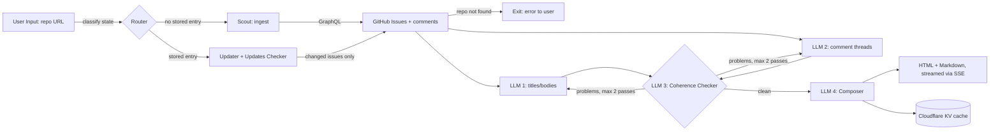

# Issue TL;DR: Design Document

Paste a public GitHub repository URL; get a short, source-anchored summary of
what its open issue tracker actually says: dominant themes, what needs
attention, and what nobody has answered yet.

This document is the source of truth for the architecture. It is written before
implementation and updated when a decision changes during the build.

---

## 1. Objective

Turn an open issue tracker (up to 100 issues plus their comment threads) into
one short, trustworthy briefing, so a maintainer or newcomer can understand the
state of a repo without reading every thread.

"Trustworthy" is a hard requirement, not a nice-to-have: the summary must be
anchored to real issue numbers and must not invent problems. That requirement is
what justifies the verification stage below.

---

## 2. System classification

This system is a **workflow**, not an autonomous agent.

The distinction matters and is stated deliberately: the path is fixed and known
at design time (fetch → summarize → verify → compose → store). No model decides
*what to do next*; models are called at fixed points to do bounded tasks. This
is the correct, cheaper, more predictable choice for a problem whose steps we can
enumerate in advance. We use the least autonomy that solves the problem.

The one place with genuine iteration is the coherence check (an
Evaluator-Optimizer loop, §4), and even that loop is bounded.

---

## 3. Architecture

---

## 4. Component roles (each node, and the pattern it implements)

| Component | Orchestration role | Is it an agent? | Responsibility |
| --- | --- | --- | --- |
| **Router** | **Routing pattern** (conditional edge) | No, deterministic branch | Classifies the request into one of two paths by checking KV: *cold* (never seen this repo) or *warm* (cached). Sends cold → Scout, warm → Updater. |
| **Scout** | Data-ingestion node (tool call) | No, deterministic fetch | Cold path. Calls the GitHub GraphQL API and pulls up to 100 open issues + up to 20 recent comments each. Pure I/O, no LLM. |
| **Updater + Updates Checker** | **Cache-with-change-detection** | No, deterministic | Warm path. Compares each issue's `updatedAt` against the cached copy; re-fetches only issues that moved, and drops digests for issues that have since closed. This is what makes a repeat run cheap. |
| **LLM 1, titles/bodies** | **Parallel Fan-Out** (runs concurrently with LLM 2) | LLM step, bounded task | Mechanical extraction: summarize each issue's title + body. High volume, low judgement. |
| **LLM 2, comment threads** | **Parallel Fan-Out** (runs concurrently with LLM 1) | LLM step, bounded task | Mechanical extraction: summarize each issue's comment thread. Same profile as LLM 1; running the two in parallel cuts wall-clock time (latency = the slower branch, not the sum). |
| **LLM 3, Coherence Checker** | **Evaluator** half of an **Evaluator-Optimizer loop** | LLM step, judgement task | Checks the LLM 1/LLM 2 digests against the source for hallucinations or incoherence. Emits a list of flagged issue numbers. If non-empty, the flagged issues (only those) go back to LLM 1/LLM 2 for a re-summary. **Bounded at 2 passes** to prevent an infinite loop; after that, the best current digest is accepted (graceful degradation). |
| **LLM 4, Composer** | Synthesis / final generation | LLM step, judgement task | Takes the verified per-issue digests and produces the reader-facing briefing: themes, "needs attention", "open questions", each anchored to issue numbers. This is the output the user actually reads. |
| **Storage (KV)** | State persistence | No | Writes the composed result + per-issue digests + fetch metadata to Cloudflare KV, 7-day TTL, so the next run can take the warm path. |

Naming honestly: only the **Router** (routing) and the **Coherence Checker**
(evaluator-optimizer) are named orchestration patterns doing real control-flow
work. LLM 1/2 are a **parallel fan-out**. Everything else is a deterministic
workflow step. Calling a plain fetch an "agent" would be wrong, and a reviewer
would catch it.

---

## 5. State / data model

The state that flows through the pipeline (and what persists to KV):

| Field | Type | Written by | Read by |
| --- | --- | --- | --- |
| `repo` | `owner/name` | input | Router, Scout |
| `path` | `cold` \| `warm` | Router | pipeline |
| `issues` | `Issue[]` | Scout / Updater | LLM 1, LLM 2 |
| `bodyDigests` | `Digest[]` | LLM 1 | LLM 3, LLM 4 |
| `commentDigests` | `Digest[]` | LLM 2 | LLM 3, LLM 4 |
| `flagged` | `issueNumber[]` | LLM 3 | loop back to LLM 1/2 |
| `passCount` | `int` | loop | loop guard (cap = 2) |
| `result` | `{ html, md }` | LLM 4 | browser, KV |

`Issue` = `{ number, title, body, comments[], updatedAt, state }`.

`Digest` is specialised per producer:
- `IssueDigest` (LLM 1) = `{ number, gist, theme, kind, severity, failed? }`
- `CommentDigest` (LLM 2) = `{ number, discussion, consensus, blockers[], openQuestions[], failed? }`

`failed` marks an issue that could not be summarised. The entry is retained so
the failure is recorded, and excluded from verification and from the composed
output (section 8).

---

## 6. Flow

**Cold path (repo never seen):**
1. Router finds no KV entry → `path = cold`.
2. Scout fetches issues + comments via GraphQL.
3. LLM 1 and LLM 2 summarize in parallel.
4. LLM 3 checks coherence; flagged issues loop back (≤2 passes).
5. LLM 4 composes the briefing.
6. Result streamed to browser (SSE) and written to KV.

**Warm path (repo cached):**
1. Router finds a KV entry → `path = warm`.
2. Updates Checker compares `updatedAt` per issue.
3. If nothing changed → serve the stored summary immediately (no model calls).
4. If some issues changed → re-fetch only those, re-summarize only those,
   re-run coherence on the affected set, re-compose, update KV.

The warm path is the cost story: a repeat run on an unchanged repo costs zero
model calls.

---

## 7. Key design decisions (the "why", stated up front)

- **GraphQL over REST for the Scout.** REST needs ~101 requests per repo (one
  for the issue list, one per issue for its comments). GraphQL fetches issues
  *and* their comments together in ~2 requests. Fewer round trips, far less
  rate-limit pressure, faster cold runs. Consequence: GraphQL rejects
  unauthenticated requests, so an operator token is required (§8).

- **Model routing by task type, not one model everywhere.** Extraction (LLM
  1/2) is high-volume and mechanical → a small, cheap model (`gpt-4o-mini`).
  Judgement (LLM 3 coherence, LLM 4 composer) needs a stronger model
  (`gpt-4o`) to avoid false flags and to write the output a human reads.
  Spending the expensive model only where judgement is required is the cost/
  quality trade-off made explicit. *(The original design named GPT-3.5, since
  retired; this table replaces it.)*

- **Bounded evaluator loop.** The coherence loop caps at **2 passes**. An
  unbounded "fix until perfect" loop is an infinite-loop and unbounded-cost
  risk. After the cap, the best current digest is accepted: graceful
  degradation over hanging.

- **Cost/scope limits, chosen not defaulted.** Up to 100 issues (most recently
  updated first), 20 comments per issue, bodies truncated to 4 000 chars,
  comments to 1 500. These bound token spend and latency deterministically.

- **Change-detection cache (KV, 7-day TTL).** Re-summarize only what moved;
  drop digests for closed issues. Without this, every run pays full price.

- **Output sanitization.** The composer's Markdown derives from arbitrary
  GitHub text, so an issue titled `` can reach the
  summary. The renderer escapes raw HTML, restricts link schemes to
  `http(s)`/`mailto`, and renders images as alt text only. Treating issue text
  as untrusted input is a security decision, not a formatting one.

- **Streaming via SSE.** A cold run is 1–3 minutes of mostly I/O wait. Progress
  is streamed as server-sent events so the user sees each stage instead of a
  two-minute spinner. A UX decision that follows from the runtime profile.

- **Coherence checker derives `ok` from the problem list**, not from the
  model's own boolean. The code trusts the enumerated problems, not a
  self-reported "looks fine". Small but deliberate: don't let the evaluator
  grade itself on a flag it can flip.

- **Endpoint protection is layered, and its limits are stated.** `/api/tldr`
  spends real money per cold run, so it sits behind three gates: a same-origin
  check (403), a short-lived HMAC-signed token minted by the page (401), and a
  per-IP quota in KV (429). The honest caveat: because this is a public site
  with no login, the browser must be given a token, so a determined person can
  read it out of the page and replay it until it expires. The token stops bots,
  scrapers and direct callers; the **quota** is what actually bounds spend.
  Real per-visitor authentication would require an identity provider (section
  11).

---

## 8. Failure handling

- **Repo not found / no access** → Exit early with a clear message to the user.
- **GitHub rate limit / API error** → surface the error; the operator token
  keeps the normal case well under limits.
- **A single issue fails to summarize** → record the failure for that issue and
  continue; one bad issue does not abort the batch. Batches run under
  `Promise.allSettled`, so a rejected batch is isolated: its issues get a
  `failed` digest and the run proceeds. If *every* batch fails, that is
  systemic (bad key, model outage) and is raised instead of yielding an empty
  briefing.
- **Coherence never converges within 2 passes** → accept the best digest
  (graceful degradation), never loop forever.
- **No KV configured** → the app still runs; it simply never caches and always
  takes the full cold path.

---

## 9. Required secrets

| Variable | Notes |
| --- | --- |
| `GITHUB_TOKEN` | PAT with `public_repo` read scope. The **operator's** token, not the visitor's; visitors never authenticate. Required because the Scout uses GraphQL. |
| `OPENAI_API_KEY` | Model access for LLM 1 to 4. |
| `AUTH_SECRET` | Signing key for the short-lived API tokens the page mints. Never sent to the browser. Rotating it invalidates every outstanding token. |

---

## 10. Success criteria

- On a real public repo, returns a themed briefing (not issue-by-issue), with a
  prioritized "needs attention" section and an "open questions" section, every
  claim anchored to issue numbers.
- A repeat run on an unchanged repo serves from cache with zero model calls.
- The coherence loop flags real problems, re-summarizes only those, and always
  terminates.
- Malicious issue text cannot inject HTML into the output.

---

## 11. Out of scope / future

- Parallelizing across issues beyond the LLM 1/2 fan-out (with a concurrency
  cap), for very large trackers.
- Filtering by label / milestone / date.
- Posting the TL;DR back to GitHub as a comment.
- Per-visitor authentication. The endpoint is protected (section 7), but the
  minted token is not tied to an identity, so it cannot resist a determined
  person. Closing that gap means an identity provider: Cloudflare Access in
  front of the Worker, or GitHub OAuth sign-in with per-user tokens and quota.

---

### Method note
This document is the source of truth. It is handed to the coding agent to
implement; the architecture, the pattern choices, and the trade-offs above are
decided here, before code. If a decision changes during implementation (e.g. a
named model is retired), this document is updated to match, not the other way
around.